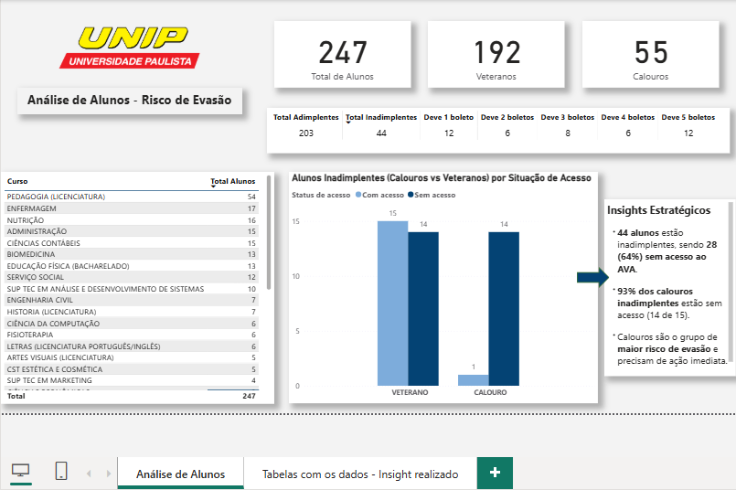
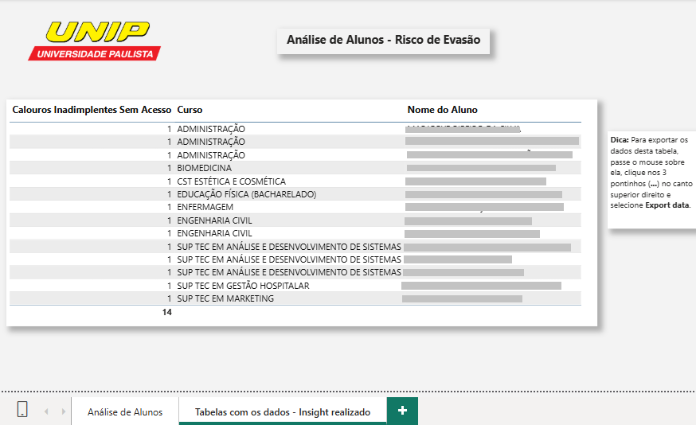

# 🎓 Análise de Alunos – Risco de Evasão (UNIP)

Este projeto apresenta um **dashboard em Power BI**, desenvolvido a partir de **dados coletados internamente por mim (funcionária da UNIP)**, com o objetivo de analisar **adimplência, acesso ao AVA, perfil (calouros x veteranos)** e identificar **grupos de maior risco de evasão** referentes ao **1º semestre de 2025**.  

---

## 📊 Páginas do Dashboard

### **1. Página 1 – Visão Geral**
- **Cabeçalho:** Logo da UNIP + título “Análise de Alunos – Risco de Evasão”.
- **Cards (KPIs):**
  - Total de alunos
  - Total de veteranos
  - Total de calouros
- **Tabela resumo financeiro:**
  - Total de adimplentes
  - Total de inadimplentes
  - Qtd de alunos devendo 1, 2, 3, 4 e 5 boletos
- **Matriz por Curso:** curso x quantidade de alunos.
- **Gráfico Clustered Column Chart (Risco):**
  - **Eixo X:** Calouro / Veterano  
  - **Legenda:** Status de Acesso (Com acesso / Sem acesso)  
  - **Valores:** Total de Inadimplentes (filtrado para adimplentes = 0)
- **Caixa de texto:** Insights Estratégicos (resumo).

### **2. Página 2 – Tabelas com os dados – Insight realizado**
- **Tabela principal:**  
  Lista de **calouros inadimplentes sem acesso**, exibindo **curso e nome do aluno**.  
- **Dica interativa:**  
  > “Para exportar os dados desta tabela, passe o mouse sobre ela, clique nos 3 pontinhos (...) no canto superior direito e selecione **Export data**.”  
- **Privacidade:** No print da página 2 (imagem `dashboard-pagina2.png`), os **nomes dos alunos foram ocultados com tarjas** para proteger dados pessoais.

---

## 🧠 Insights Estratégicos
- **44 alunos** estão inadimplentes, sendo **28 (64%) sem acesso ao AVA**.  
- **93% dos calouros inadimplentes** estão sem acesso (14 de 15).  
- **Calouros inadimplentes sem acesso** são o **grupo mais crítico** (maior risco de evasão).
- **Veteranos inadimplentes com acesso** (15 alunos) têm maior chance de recuperação.

---

## 🛠 Ferramentas & Técnicas
- **Power BI Desktop**  
- **DAX (Data Analysis Expressions)**  
- **Filtros de visualização**

---

## 📥 Como visualizar
- Abra o arquivo `dashboard/Analise_Alunos_UNIP.pbix` no **Power BI Desktop**.
- **Pré-visualizações:**  
  - **Página 1:**   
  - **Página 2 (dados com tarjas nos nomes):** 

---

## 📝 Nota
> Os dados utilizados são internos, coletados como parte do meu trabalho na UNIP. A análise foi realizada **por iniciativa própria** para entender melhor o comportamento dos alunos no **1º semestre de 2025**.
